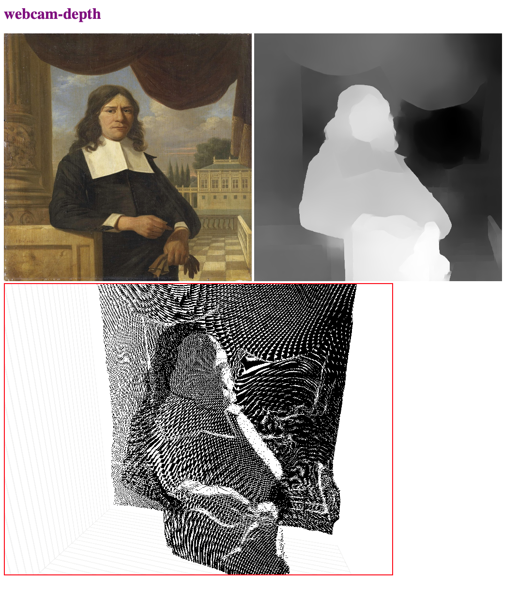

# camera-depth



### model conversion
```
cd depth
...
nyu.h5 (from https://github.com/ialhashim/DenseDepth)
waving.png (without alpha)
...
conda create -n camera-depth-conversion
conda activate camera-depth-conversion
pip install keras pillow matplotlib scikit-learn scikit-image opencv-python pydot
pip freeze > requirements.txt
python first.py
```

### ui experiments
z-scale > 1
POINT_CLOUD_ROTATE_Y > 0
CONTROLS_ZOOM_SPEED > 1
fix multiple THREE issue, from bad dependencies

### three bits
- https://threejsfundamentals.org/threejs/lessons/threejs-custom-buffergeometry.html
- https://threejs.org/docs/#api/en/core/BufferGeometry

